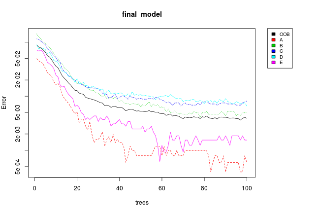

---
title: "Rondom forest prediction of weight lifting data"
output:
  html_document:
---


## Practical Machine Learning Project
=====================================


### Executive summary

This project analyze a data set collected from measurement devices attached on 6 participants 
while they are doing weight lifting exercises, then proceeds to build a series of random forest
models to predict the manner in which they did the exercise. A k-fold (k=10) corss validation
is performed on the subdivisions of the training data; the missclassification rates and OOB
error rates are calculated for each fold step; a final model is selected based these rates;
and the final model is used to precdict 20 different test cases.

### Data processing

The training and testing data for this project are download from:

```
    https://d396qusza40orc.cloudfront.net/predmachlearn/pml-training.csv
    https://d396qusza40orc.cloudfront.net/predmachlearn/pml-testing.csv
```

More information can be found at http://groupware.les.inf.puc-rio.br/har
(see the section on the Weight Lifting Exercise Dataset).
THe data came fron accelerometers attached on the belt, forearm, arm, and dumbell. The testers were asked to
perform barbell lifts in 5 different ways: correct way (A), and incorrect ways (B, C, D, E).

In addition, the "classe" variable in the training set labels the correst class.
The "problem_id" variable in the testing set labels the case number.


#### Data loading


First is to load traning and testing data set and required libraries:


```r
library(caret)
library(randomForest)
library(verification)

mf_train <- read.csv("pml-training.csv", head=TRUE, stringsAsFactors=F,
                     na.strings=c("NA", "", " ", "#DIV/0!"))
mf_test <- read.csv("pml-testing.csv", head=TRUE, stringsAsFactors=F,
                    na.strings=c("NA", "", " ", "#DIV/0!"))
```


#### Data cleanup

This project will use randomForest package to build a prediction model.
First we can do is to cleanup the data set.

Since we only need device measurement variables (the columns names containing
substrings like "_belt", "_arm", "_dumbbell" or "_forearm") to predict
the outcome, we will remove timestamps, windows, and user ids variables 
which add unnecessary noises. We also remove variables which has missing
values since the random forest model does not work well with missing values. 


```r
has_pattern <- function(pts, et) {
    rt <- FALSE
    for(p in pts) {
        rt <- rt | grepl(p, et, ignore.case = TRUE)
    }
    rt
}

# helper function to decide which column to keep
rem_cols <- function(df) {
    nr <- nrow(df)
    nms <- names(df)
    len <- length(nms)
    nv <- rep(TRUE, len)
    for (i in 1:len) {
        # only keep measurement columns which contain no NA
        if(has_pattern(c("_belt", "_arm", "_dumbbell", "_forearm"), nms[i])) {
            nn <- sum(is.na(df[, i]))
            if (nn > 0) {
                nv[i] <- FALSE
            }    
        } else {
            nv[i] <- FALSE
        }
    }
    nms[nv]
}
rrs <- rem_cols(mf_train)

df_train <- mf_train[, c("classe", rrs)]
df_train$classe <- as.factor(df_train$classe)
df_test <- mf_test[, c("problem_id", rrs)]
```

Since the original data set was partially ordered by user_names, num_windows
and time stamps, we randomly permute the rows so our models will not depend
on these specific orders.


```r
set.seed(2222)
df_tr <- df_train[sample(1:nrow(df_train), replace=FALSE), ]
```

### Random forest model

As mentioned earlier, we will use the randomForest package to build the prediction
model. A random forest model has many paramaters. One of the most important parameters
is "mtry" (number of variables randomly sampled as candidates at each split).
We can use tuneRF to find the optimal value:


```r
set.seed(3333)
bestmtry <- tuneRF(df_tr[, -1], df_tr[, 1], ntreeTry=300, stepFactor=2, improve=0.01)
```

```
## mtry = 7  OOB error = 0.26% 
## Searching left ...
## mtry = 4 	OOB error = 0.33% 
## -0.2549 0.01 
## Searching right ...
## mtry = 14 	OOB error = 0.32% 
## -0.2353 0.01
```

 

```r
bestmtry
```

```
##        mtry OOBError
## 4.OOB     4 0.003262
## 7.OOB     7 0.002599
## 14.OOB   14 0.003211
```

It turns out the best mtry value is 7. So mtry=7 will be used in the
randomForest model.


#### randomForest models and k-fold cross validation

Next, perform a k-fold cross validation procedure with k = 10.
During each step, the forest model is saved in list ll, and the miss classification
rate is saved in vector ev.


```r
k <- 10
n <- floor(nrow(df_train)/k)
ev <- rep(NA, k)  # vector for miss classification rate
ll <- list()      # list to record forest models for each steps

## helper function to calculate miss classification
missClass = function(values,prediction) {sum(prediction != values)/length(values)}

set.seed(5555)
for (i in 1:k) {
    s1 <- ((i-1)*n + 1)
    s2 <- i*n
    ss <- s1:s2
    
    # subdivide the training set into train and test subsets
    cv_train <- df_tr[-ss,]
    cv_test <- df_tr[ss,]
    rf <- randomForest(x=cv_train[, -1],
                       y=cv_train[, 1],
                       ntree=100,
                       nodesize=3,
                       #proximity=T,       # required too much memory
                       keep.forest=TRUE, importance=TRUE,
                       mtry=7)
    pred <- predict(rf, newdata=cv_test[, -1])

    ll[[i]] <- rf                          # record the forest
    ev[i] <- missClass(cv_test[, 1], pred) # record missclassification rate
}
```

#### Model evaluation

To evaluate these models, first plot the OOB errors and
missclassification rates for the 10 models:


```r
# helper function to calculate the OOB error for a give model
get_oob <- function(fit) {
    k <- 5
    cf <- fit$confusion[, 1:k]
    tot <- 0
    et <- 0
    for (i in 1:k) {
        for (j in 1:k) {
            x <- cf[i, j]
            tot <- tot + x
            if (i != j) {
                et <- et + x 
            }
        }
    }
    et/tot
}
ov <- sapply(1:10, FUN=function(i) { get_oob(ll[[i]]) })

df_rates <- data.frame(
    OOB = ov,
    Missclassification = ev,
    Step = 1:k)

require("reshape")
```

```
## Loading required package: reshape
```

```r
rates_long <- melt(df_rates, id="Step")  # convert to long format
ggplot(data=rates_long,
       aes(x=Step, y=value, colour=variable)) +
       xlab("Fold step") +
       ylab("Error rate") +
       scale_x_continuous(breaks = seq(0, 11, 1)) +
       ggtitle("OOB error and Misclassification rate") +
       geom_line()
```

 

#### Final model


Based on the data, the final model selected is the 7th forest which has
both low missclassification rate and low OOB error. The estimated OOB error
for this model is 0.0039.


```r
best_idx <- 7
final_model = ll[[best_idx]]
layout(matrix(c(1,2), nrow=1), width=c(4,1)) 
par(mar=c(5,4,4,0))
plot(final_model, log="y")
par(mar=c(5,0,4,2))
plot(c(0,1), type="n", axes=F, xlab="", ylab="")
legend("top", colnames(final_model$err.rate), col=1:6, cex=0.8, fill=1:6)
```

 

We can take a look at a tree in the selected model and the variable importance:


```r
tr1 <- getTree(final_model, 1, labelVar=TRUE)
head(tr1[, -5], n=25)
```

```
##    left daughter right daughter         split var split point prediction
## 1              2              3       accel_arm_x    -270.500       <NA>
## 2              4              5  magnet_forearm_x     -42.500       <NA>
## 3              6              7    pitch_dumbbell     -25.721       <NA>
## 4              8              9       accel_arm_z    -115.500       <NA>
## 5             10             11 magnet_dumbbell_z      78.000       <NA>
## 6             12             13  accel_dumbbell_x    -199.000       <NA>
## 7             14             15      gyros_belt_z       0.075       <NA>
## 8             16             17           yaw_arm      45.100       <NA>
## 9             18             19  magnet_forearm_y    -245.500       <NA>
## 10            20             21   accel_forearm_x     -19.000       <NA>
## 11            22             23 magnet_dumbbell_y     410.000       <NA>
## 12            24             25   total_accel_arm      35.500       <NA>
## 13            26             27      gyros_belt_z       0.060       <NA>
## 14            28             29          yaw_belt       3.305       <NA>
## 15            30             31        pitch_belt       3.675       <NA>
## 16            32             33       accel_arm_y     202.500       <NA>
## 17            34             35       accel_arm_z    -165.000       <NA>
## 18            36             37          yaw_belt      -2.765       <NA>
## 19            38             39 magnet_dumbbell_y     286.500       <NA>
## 20             0              0              <NA>       0.000          B
## 21            40             41   gyros_forearm_x       0.890       <NA>
## 22            42             43        pitch_belt       3.770       <NA>
## 23             0              0              <NA>       0.000          E
## 24             0              0              <NA>       0.000          A
## 25             0              0              <NA>       0.000          E
```

```r
varImpPlot(final_model)
```

 

We can see that the top important variables are "yaw_belt", "roll_belt",
"magnet_dumbbell_z", "pitch_belt", "magnet_dumbbell_y", "pitch_forearm".

### Prediction on the testing set

Now apply the final model to testing set and get prediction:


```r
test_pred <- predict(final_model, newdata=df_test[, -1])
test_pred
```

```
##  1  2  3  4  5  6  7  8  9 10 11 12 13 14 15 16 17 18 19 20 
##  B  A  B  A  A  E  D  B  A  A  B  C  B  A  E  E  A  B  B  B 
## Levels: A B C D E
```

### Thanks

The data for this project come from this source: http://groupware.les.inf.puc-rio.br/har.
Thanks for the generousity of the authors.


